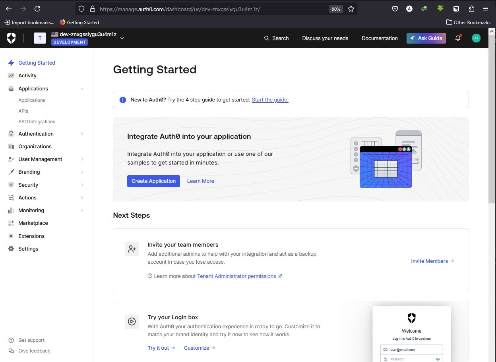
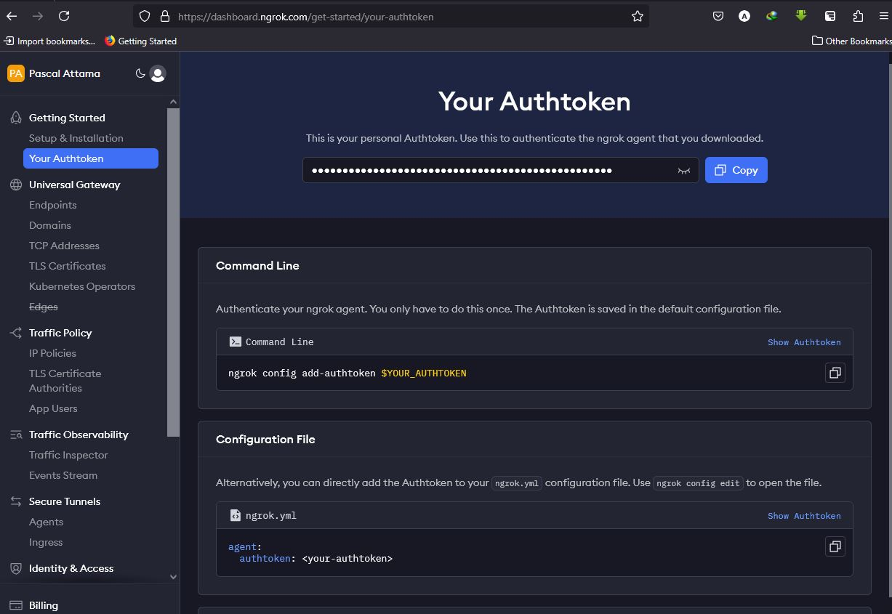
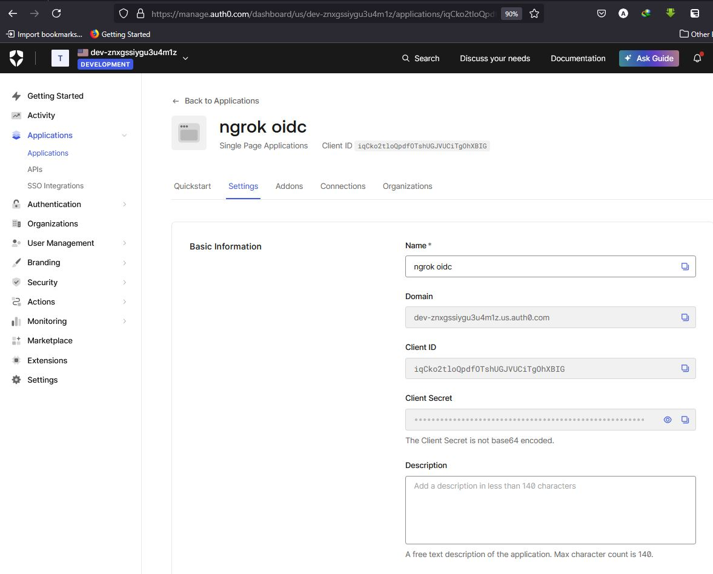
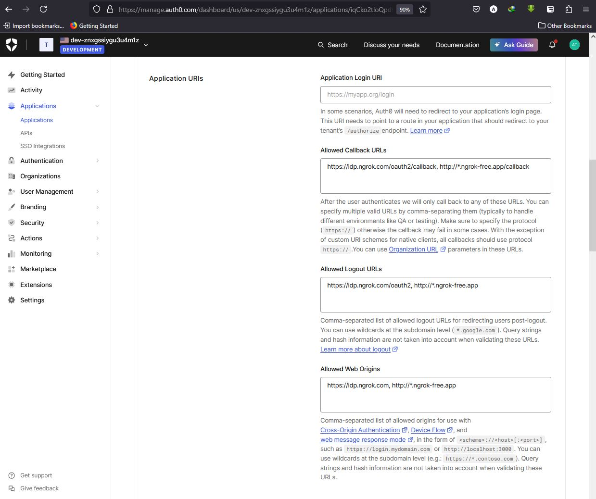
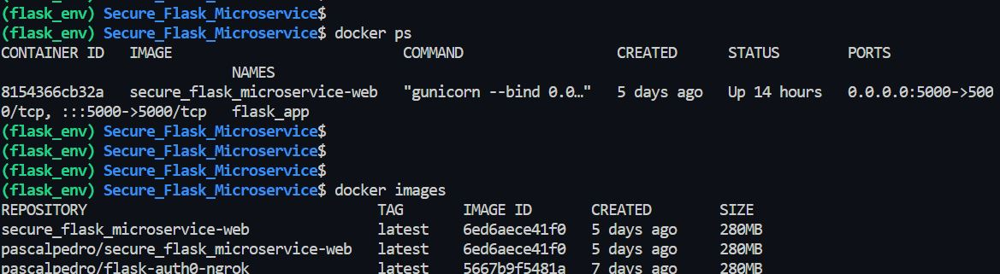
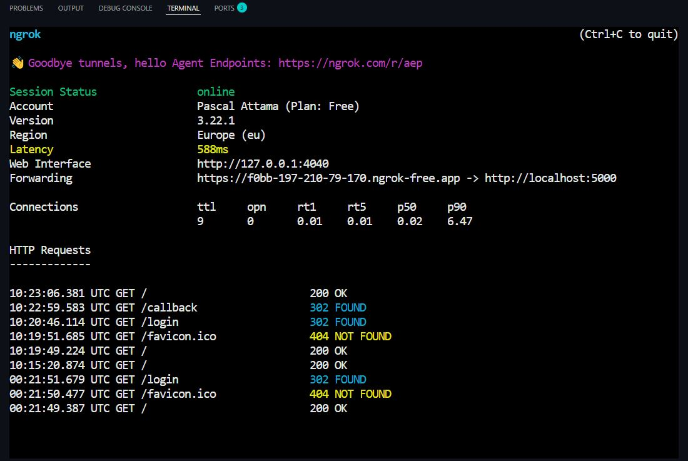
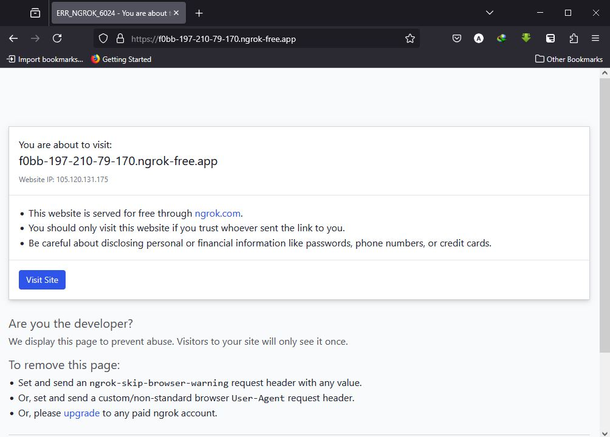
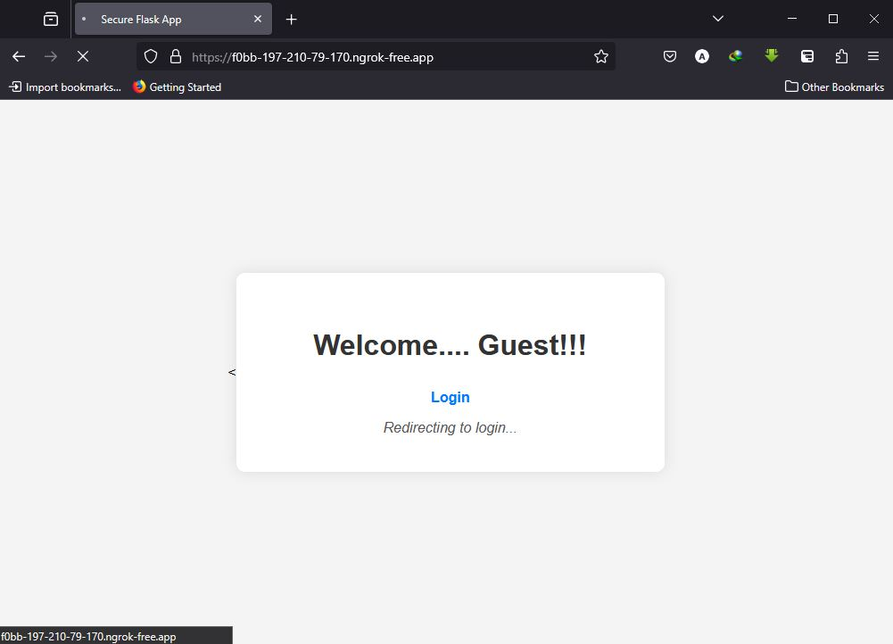
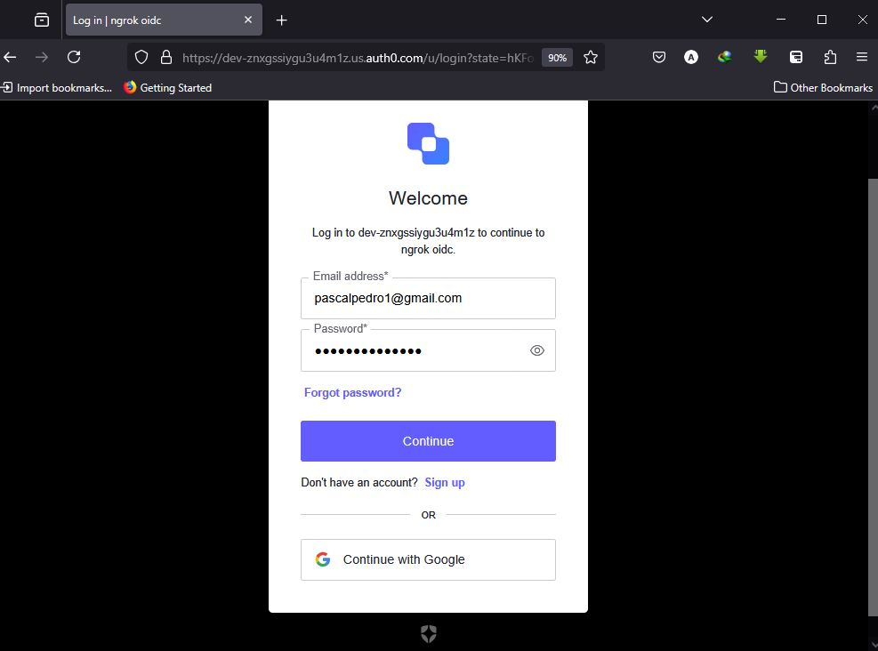
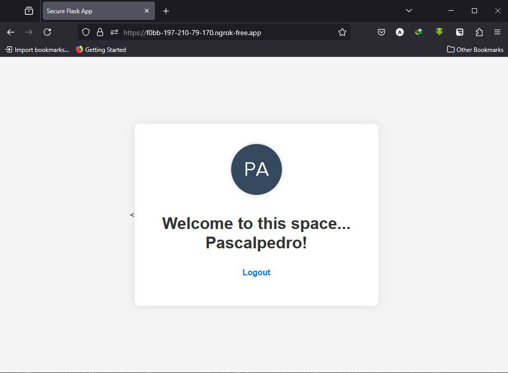

# Custodia


## Introduction!!!

### Custodia: a robust and Scalable Enterprise-Grade Web app with Enhanced Security.
---
In today's fast-paced digital economy, businesses face the pressing challenge of delivering secure, scalable, and responsive web services that can adapt to changing market demands. Introducing the Secure and Scalable Flask Microservice `Custodia`, a cutting-edge solution that combines the power of Flask, Docker, ngrok, and Auth0 to revolutionize the way you build and deploy your web-based applications.


As businesses strive to stay ahead of the competition, the need for a reliable and secure web service infrastructure has become increasingly critical. `Custodia` addresses this crucial requirement by providing a comprehensive and scalable solution that can be tailored to the unique needs of your organization.

At the core of this project is a Flask-based web service, a lightweight and flexible Python framework that forms the backbone of the application's functionality. To ensure secure access to this service, we have integrated ngrok, a secure tunneling solution that creates an encrypted channel which allows controlled access to the web service. This approach safeguards your web service from direct exposure, shielding it from potential threats and enabling secure access for your users.

To further strengthen the security of `Custodia`, we have incorporated Auth0, a leading identity and access management (IAM) platform. Auth0 handles user management, authentication, and authorization, ensuring that only authorized individuals can access the application's features and data, providing an additional layer of protection for your business-critical information.

`Custodia` is built using Docker containerization, a technology that enables the efficient deployment and scaling of your web service across multiple environments. By containerizing the Flask app, we have created a highly portable and scalable solution that can be easily managed and deployed, allowing your business to adapt quickly to changing market conditions and user demands.

With the integration of Nginx as a reverse proxy and Gunicorn as the application server, we have implemented a robust and high-availability architecture that can handle increased traffic and ensure the seamless operation of your web service.

By combining these powerful components, we created Custodia that offers the following key benefits:

- **Secure Communication**: The ngrok tunneling service provides a secure, encrypted channel for accessing the Flask web service, protecting it from direct internet exposure.
- **Enhanced Security and Robust Authentication**: The secure VPN tunneling with ngrok, integration with Auth0 for user management and authentication, and the containerized and microservice-based architecture enhance the overall security posture of the web service, protecting it from potential threats and unauthorized access.
- **Scalable Architecture**: The Docker containerization of the Flask app, the Nginx load balancer, and the Gunicorn application server enable easy scaling and deployment of the web service across multiple environments, ensuring high availability and the ability to handle increased user traffic.
- **Flexibility and Adaptability**: The use of Flask, a lightweight and flexible Python framework, the containerized and microservice-based architecture, and the ability to quickly scale and deploy the web service across different environments empower businesses to adapt to market changes and emerging requirements.
- **Improved Reliability and Maintainability**: The high-availability architecture, the modular and microservice-based design, and the containerized and automated deployment processes enhance the overall reliability and consistency of the web service, reducing the risk of downtime and simplifying the troubleshooting and debugging processes.
- **Cost-effectiveness**: The modular and microservice-based design, the containerization and automated deployment processes, and the reusability and portability of the containerized Flask app lead to cost savings by reducing the complexity of development, testing, and deployment, and streamlining the infrastructure management.

Whether you're a developer, a system administrator, or a business stakeholder, `Custodia` offers a reliable and secure foundation for your web-based applications. Join us in this exciting journey as we explore the benefits of this cutting-edge architecture and unlock new possibilities in the world of secure and scalable web services.

---
### Key Features of Custodia!!!

- **Flask-based Web Service**: The project utilizes the lightweight and flexible Flask web framework to power the core functionality of the web service.
- **Docker Containerization**: The Flask app is containerized using Docker, enabling easy deployment, scaling, and management of the web service.
- **Secure Tunneling with ngrok**: The project integrates ngrok, a secure tunneling solution, to create an encrypted channel and shield the web service from direct internet exposure.
- **Authentication with Auth0**: The project incorporates Auth0, a leading identity and access management platform, to handle user management, authentication, and authorization.
- **Scalable and High-Availability Architecture**: The project leverages Nginx as a reverse proxy and Gunicorn as the application server to create a scalable and high-availability architecture for the web service.
- **Modular and Microservice-based Design**: The project follows a microservice architecture, enabling independent deployment, scaling, and maintenance of the various components.
- **Automated Deployment and Management**: The project leverages Docker and configuration files to enable automated deployment and management of the web service.
- **Flexible and Extensible**: The Flask-based web service, combined with the modular and microservice-based design, provides a flexible and extensible foundation for building and enhancing web applications.

---
## System Architecture

### Architecture Diagram
(Add an architectural diagram here to show the relationships between services)

### Project Structure
```
Custodia
│── app.py
│── requirements.txt
│── .env
│── templates/
│   ├── home.html
│── Dockerfile
│── nginx.conf
│── docker-compose.yml
│── README.md
│── docs/
│   ├── screenshots/
```
---
## PREREQUISITES

1. **Server**: A running linux server (e.g., AWS EC2, on-prem server, or any other cloud provider) with Ubuntu.

2. **SSH Key Pair**: Access to the server via SSH.

3. **Security Group/Firewall**:
   - Open port 22 (SSH).
   - Open port 80 (HTTP)
   - Open port 443 (HTTPS)
   - Open port 5000 (Flask).
  
4. **Softwares on the Server**:
   - Docker
   - Docker Compose
   - Python 3 and pip
   - snapd
   - screen
   - ngrok

5. **Environment Variables**:
   - `AUTH0_CLIENT_ID`
   - `AUTH0_CLIENT_SECRET`
   - `AUTH0_DOMAIN`
   - `APP_SECRET_KEY`

6. **Auth0 Account**: an auth0 activated account.



7. **Ngrok Authtoken**: An ngrok account with an authtoken.


---
## QUICK SETUP:

1. **Connect to the remote server**: From your local machine, SSH into the remote server using the provided username and password.

2. **Create a new user account**:
   - Set up the username and password using the below commands:

    ```bash
    sudo useradd -m $USERNAME
    sudo usermod -aG sudo $USERNAME 
    sudo passwd $USERNAME  
    ```

3. **Install Required Software**:

   ```bash
   sudo apt update 
   sudo apt install docker.io docker-compose python3 python3-pip snapd screen  
   sudo apt install snapd
   sudo snap install ngrok  # ngrok can't be installed directly using the apt package manager on Ubuntu because it's not available in the Ubuntu official package repositories.
   ```

    - Alternatively, you can as well check the [**Ngrok Official Documentation**](https://ngrok.com/docs/guides/device-gateway/linux/) or [**Ngrok Setup & Installation**](https://dashboard.ngrok.com/get-started/setup/linux) page to walk you through the process of installing the ngrok agent on a remote Linux device.

4. **Set Up Docker and Docker Compose**:
   - Enable and start Docker:

   ```bash
   sudo systemctl enable docker
   sudo systemctl start docker
   sudo usermod -aG docker $USERNAME
   newgrp docker
   ```

5. **Create a project directory (dir)**: 
   - Set up a dir to contain your scripts and configuration files and change the ownership of the dir to the current user.

    ```bash
    mkdir Custodia
    chown -R $USERNAME:$USERNAME /home/$USERNAME/Custodia
    cd Custodia
    ```

6. **Set Up and Activate a Virtual Environment (env)**:

    ```bash
    python3 --version
    apt install python3-virtualenv
    python3 -m venv flask_env
    source flask_env/bin/activate
    ```

7.  **Install Python packages and dependencies**:

      ```bash
      pip install package_name
      pip list
      pip freeze > requirements.txt  # to create a requirements.txt file, generate a list of all the installed libs, their versions and export them to the newly created file. 
      ```
    OR
    
    - You can append the list of the python packages needed inside a requirements.txt file and then install them using `pip install -r requirements.txt` command.
---
### BUILDING THE CODE BLOCKS

1.  **Set Up Environment Variables**:
    - Create a `.env` file with the necessary variables in your project root dir.

2.  **Create a basic app.py script**:
    - Using a text editor, create an `app.py` which create a simple web application that returns a JSON response with a greeting message and the current timestamp.

        ```python
        from flask import Flask
        from gevent.pywsgi import WSGIServer
        from datetime import datetime

        app = Flask(__name__)

        @app.route('/')
        def hello():
            return {
                'message': 'Hello, Flask... This is Pascal!!!',
                'timestamp': datetime.now().isoformat()
            }

        if __name__ == '__main__':
            # Debug/Development
            app.run(host='0.0.0.0', port=5000, debug=True)
        ``` 
    N/B: The essence of this basic app.py is to use it to set-up and test the `virtual-environ, ngrok, and screen` tools and verify that the tools are working. Involving the Auth0 code at this earlier stage will make the code a bit complex and might lead to debugging and complications.


3.  Test the `app.py` script by running the below command in your terminal:

    ```bash
    python3 app.py
    ```
    To confirm that the app is up and running, launch your browser and go to either `localhost:5000`, `127.0.0.1:5000`, `Your_Server_IP:5000` or run the `curl command` below from the terminal:

     ```bash
        curl 127.0.0.1:5000
        curl $Your_Server_IP:5000
     ```
    
    **Note**: If you encountered any blocker, kindly analysis the error messages and log files for further information.

4.  **Set Up ngrok**:
    - Navigate to [**Ngrok Official Page**](https://ngrok.com/) and `sign up` for a new account.
    - Provide the required credentials and set up your account.
    - Login to your [Ngrok Dashboard](https://dashboard.ngrok.com/) and click on `Your Authtoken` to copy out your personal token that will be used to authenticate the ngrok agent that you downloaded on your server.
    - In your terminal, input the below command:

        ```bash
        ngrok authtoken <auth_token>  # the $auth_token copied from above.
        ```

6.  **Run Flask App and ngrok in Screen Sessions**:
    - The `screen` app is a  terminal multiplexer, which allows you to create, access, and manage multiple independent terminal sessions within a single terminal window or remote SSH session. Although it's optional, but it provides a convenient way to manage and maintain the different components of your development setup, making it easier to work on and deploy your Flask application, especially when using a tunneling service like ngrok.

        ```bash
        screen -S flask
        python3 main.py
        # Press Ctrl+A, then D to detach

        screen -S ngrok
        ngrok http 5000
        # Press Ctrl+A, then D to detach
        ```

7.  **Spin-up Ngrok**:
- Serve the application via the ngrok ingress
    -  Fire up the ngrok agent and start a HTTP tunnel forwarding pointing to your flask app using:
  
        ```bash
        ngrok http 5000
        ```

    - Ngrok will serve the flask app via the URL listed by the ngrok agent, mapped to `Forwarding` in the ngrok terminal, e.g: [Forwarding URL](https://492b-2a01-7e01-00-f03c-95ff-fe50-61f2.ngrok-free.app), copy and paste into a web browser.
    - Click on the `Visit Site` button displaying on the webpage, verify that you can access the flask app service via ngrok secure tunnel.
    - The above ngrok generated url can be shared to trusted users with access to web browsers, to verify accessiblity of the flask app service via a secure tunneling solutions.

---
### INTEGRATING WITH EXTERNAL USER MANAGEMENT

1. **Setting Up Auth0**:
    - For the external authentication and user management system integration with the VPN tunneling solution, let's use `Auth0 authentication` because of it's seamless compactibility with Ngrok.
    - Navigate to [**Auth0 Official Page**](https://auth0.com/signup/) and `sign up` for a new Auth0 account.
    - From the Auth0 Administrative Dashboard, click **Applications** > **Applications,** and then click **Create Application**.
    - On the Create application popup, enter **ngrok oidc** as the application name, select the **Single Page Web Application** tile, and then click **Create**.
    - On the ngrok app page, click the Settings tab and copy the `Domain, Client ID, and Client Secret` values, to be used later.
    - Enter the URLs `https://idp.ngrok.com/oauth2/callback` `http://*.ngrok-free.app/callback` in the **Allowed Callback URLs** field, and enter the URLs `https://idp.ngrok.com/oauth2` `http://*.ngrok-free.app` in the **Allowed Logout URLs** field. Also for security checks, enter the URLs `https://idp.ngrok.com` `http://*.ngrok-free.app` in your **Allowed Web Origins** field.





2.  - Return to the root directory of the project in the terminal and create a `.env` file and pass in the following parameters:

        ```plaintext
        AUTH0_CLIENT_ID=your_auth0_client-id
        AUTH0_CLIENT_SECRET=your_auth0_client_secret
        AUTH0_DOMAIN=your_auth0_client_secret
        APP_SECRET_KEY= # generated using a secure random number generator
        ```

        - To generate the `APP_SECRET_KEY`, use the secure random number generator provided by default in the machine by running this command:
            ```bash
            openssl rand -hex 32
            ```
3.  - Launch the ngrok application again, and fire up a `HTTP Ngrok tunnel` using the below command, replacing `AUTH0_OAUTH_URL` with the domain copied from Auth0, `AUTH0_CLIENT_ID` with the client id from Auth0, and `AUTH0_CLIENT_SECRET` with the client secret copied from Auth0:

        ```bash
        ngrok http 5000 --oidc=AUTH0_OAUTH_URL \--oidc-client-id=AUTH0_CLIENT_ID \--oidc-client-secret=AUTH0_CLIENT_SECRET
        ```
4.  - Copy the URL available next to forwarding and launch your app. You will be redirected for authentication with Auth0.

5.  - Sign up with a new account and complete the authentication and gain secured access to the `flask_app` web service.
---
### ADD LOGIN TO THE FLASK APPLICATION!!!

Auth0 makes it possible to add authentication to the Flask web application and gain access to user profile information built with the Flask framework and Authlib OAuth library.

1.  **Install python dependencies**:
    - Append the following python libs to your `requirements.txt` file:
        ```bash
        flask>=2.1.2
        python-dotenv>=0.21.0
        authlib>=1.2.0
        requests>=2.28.1
        ```
    - Run the following command from your terminal to enable these dependencies in your project:
        ```bash
        pip install -r requirements.txt
        ```
2.  **Setup your Flask app with the Auth0 parameters**:
    - Import all the libs required by your flask application.
    - Load your `.env` file that was initially created.
    - Configure Authlib to handle your application's authentication with Auth0 using the `oauth.register()` function.
    - In the flask-app python script, append the `python dependencies`, and the four `auth0 routes` into the scripts. The four routes are:
        - `/login` route used to direct visitors to the Auth0 login page.
        - `/callback` route saves the session for the user and bypasses the need for them to login again when they return.
        - `/logout` route used to sign users out from the application.
        - `/home` route renders an authenticated user's details or allows vistors to sign in.

    - Modify your existing `app.py` script by appending the **auth0 functions()** to it. The modified `app.py` script should have the below contents:
      ```py
      import json
        from os import environ as env
        from urllib.parse import quote_plus, urlencode

        from authlib.integrations.flask_client import OAuth
        from dotenv import find_dotenv, load_dotenv
        from flask import Flask, redirect, render_template, session, url_for

        # Load environment variables from .env
        ENV_FILE = find_dotenv()
        if ENV_FILE:
            load_dotenv(ENV_FILE)

        app = Flask(__name__)
        app.secret_key = env.get("APP_SECRET_KEY")

        # OAuth configuration for Auth0
        oauth = OAuth(app)
        oauth.register(
            "auth0",
            client_id=env.get("AUTH0_CLIENT_ID"),
            client_secret=env.get("AUTH0_CLIENT_SECRET"),
            client_kwargs={
                "scope": "openid profile email",
            },
            server_metadata_url=f'https://{env.get("AUTH0_DOMAIN")}/.well-known/openid-configuration'
        )

        # Login route
        @app.route("/login")
        def login():
            return oauth.auth0.authorize_redirect(
                redirect_uri=url_for("callback", _external=True)
            )
        # Auth0 callback route
        @app.route("/callback", methods=["GET", "POST"])
        def callback():
            token = oauth.auth0.authorize_access_token()
            session["user"] = token
            return redirect("/")

        # Logout route
        @app.route("/logout")
        def logout():
            session.clear()
            return redirect(
                "https://" + env.get("AUTH0_DOMAIN")
                + "/v2/logout?"
                + urlencode(
                    {
                        "returnTo": url_for("home", _external=True),
                        "client_id": env.get("AUTH0_CLIENT_ID"),
                    },
                    quote_via=quote_plus,
                )
            )

        # Home route
        @app.route("/")
        def home():
            return render_template(
                "home.html",
                session=session.get('user'))

        # Run the app (this is for development; Gunicorn will be implemented on the Dockerfile for production)
        if __name__ == "__main__":
            app.run(host="0.0.0.0", port=env.get("PORT", 5000))  
        ```


3.  **Add templates**:
    - Create a sub-dir in your project root folder named `templates` and create a `home.html` file in the dir.
    - Append the following html script into the `home.html` file:
```html
<<!DOCTYPE html>
<html lang="en">
<head>
  <meta charset="UTF-8" />
  <meta http-equiv="X-UA-Compatible" content="IE=edge" />
  <meta name="viewport" content="width=device-width, initial-scale=1.0" />
  <title>Secure Flask App</title>
  <style>
    body {
      font-family: Arial, sans-serif;
      background-color: #f4f4f4;
      display: flex;
      align-items: center;
      justify-content: center;
      height: 100vh;
      margin: 0;
      text-align: center;
    }

    .container {
      background-color: #fff;
      padding: 40px;
      border-radius: 10px;
      box-shadow: 0 0 15px rgba(0, 0, 0, 0.1);
      max-width: 400px;
      width: 100%;
      position: relative;
    }

    h1 {
      color: #333;
    }

    p {
      margin-top: 20px;
    }

    a {
      color: #007BFF;
      text-decoration: none;
      display: inline-block;
      margin-top: 10px;
      font-weight: bold;
    }

    a:hover {
      text-decoration: underline;
    }

    img.profile-pic {
      border-radius: 50%;
      width: 100px;
      margin-bottom: 15px;
      box-shadow: 0 0 8px rgba(0, 0, 0, 0.2);
    }

    /* Toast notification */
    #toast {
      display: none;
      position: fixed;
      top: 20px;
      right: 20px;
      background: #007BFF;
      color: white;
      padding: 12px 20px;
      border-radius: 5px;
      box-shadow: 0 0 10px rgba(0,0,0,0.2);
      z-index: 999;
    }

    /* Loader */
    #loader {
      display: none;
      margin-top: 15px;
      font-style: italic;
      color: #555;
    }

    @media (max-width: 480px) {
      .container {
        padding: 20px;
        max-width: 90%;
      }
    }
  </style>
</head>
<body>
  <div class="container">
    <div id="toast">Logged in successfully!</div>
    
      
      <h1>Welcome to this space... {{ session.userinfo.name }}!</h1>
      <p><a href="/logout">Logout</a></p>
    
      <h1>Welcome.... Guest!!!</h1>
      <p><a href="/login" onclick="showLoader()">Login</a></p>
      <div id="loader">Redirecting to login...</div>
    
  </div>

  <script>
    function showLoader() {
      document.getElementById('loader').style.display = 'block';
    }

    // Show toast if redirected from Auth0
    window.onload = function () {
      const toast = document.getElementById('toast');
      if (window.location.href.includes('callback')) {
        toast.style.display = 'block';
        setTimeout(() => toast.style.display = 'none', 3000);
      }
    };
  </script>
</body>
</html>
```

---
### CONTAINERIZATION

1.  -**Scaling with Docker**:
    - Create a `Dockerfile` script on your project root dir, where the flask script and requirements.txt files are located and append the below scripts:

        ```Dockerfile
        # Use a base image with the latest version of Python
        FROM python:3.9-slim

        # Set the working directory
        WORKDIR /app

        # A blueprint for installing necessary dependencies and libs
        COPY requirements.txt .

        # Install the required dependencies
        RUN pip install --no-cache-dir -r requirements.txt

        # Copy the Python script into the container
        COPY . .

        # Use Gunicorn to serve the Flask app and expose the port that the flask app will run on
        CMD ["gunicorn", "--bind", "0.0.0.0:5000", "app:app"]
        ```
    The overall purpose of this Dockerfile is to create a Docker image that can be used to run the Flask-based web application. The image will have the necessary Python dependencies installed, and the Flask application will be served using the Gunicorn web server.

2.  -**Building the Docker image**:
    - Verify that your `pwd` is the dir where your `Dockerfile` `app.py` and `requirements.txt` files are located, and build the flask image using the below:

        ```bash
        docker build -t flask_auth0 .
        ```

3.  -**Running the Docker image**:
    - Run the container that was created based on your `flask_app` image:

        ```bash
        docker images  # to verify that the image is in your repo
        docker run -p 5000:5000 --env-file .env flask-auth0
        ```


      And you now have an optimized Flask server embedded with **auth0 authentication** parameters running in a Docker container.

    You should be able to check it in your Docker container's URL, for example: <a href="Your_Server_IP" target="_blank">http://Your_Server_IP:5000</a> or <a href="http://127.0.0.1" target="_blank">http://127.0.0.1:5000</a>

    


4. **Spin-up Ngrok**:
    - Following the same procedure we used earlier with `Ngrok` to when we deployed the service directly using the python command, verify that you can access the flask app service via Ngrok secure VPN tunnel by:

   - Serve the application via the ngrok ingress and start a HTTP tunnel forwarding pointing to your `flask_auth0` docker container using:
  
        ```bash
        ngrok http 5000
        ```

    - Ngrok will serve the `flask_auth0` docker container via the URL listed by the ngrok agent, mapped to `Forwarding` in the ngrok terminal, e.g: [Forwarding URL](https://492b-2a01-7e01-00-f03c-95ff-fe50-61f2.ngrok-free.app).
      
    -  Copy the URL available next to forwarding and launch your app. You will be redirected for authentication with Auth0.
    - Click on the `Visit Site` button displaying on the webpage.
   - Sign up with a new account and complete the authentication and gain secured access to the `flask_app` web service.

    -  Verify that you can access the `flask_auth0` service embedded with **auth0 user authenticationa and management** via ngrok secure tunnel.
    - The above ngrok generated url can be shared to users with access to web browsers, to create accounts and have access to the flask app service via a secure tunneling solutions.

---
### LOAD BALANCING & SCALABILITY!!!

**Nginx**:
    - a powerful and widely-used web server that can also function as a reverse proxy, load balancer, and HTTP cache.

Let's integrate Nginx with our `Secure Flask Microservice` app to create a more robust, scalable, and secure web application infrastructure. Nginx's flexibility and efficiency make it a popular choice for hosting and managing web applications, especially in production environments.

- Create an nginx configuration file called `nginx.conf` in your project root dir and append the below scripts:
    ```plain
    # Define the load-balanced backend servers
    upstream web_servers {
        least_conn;
        server flask_app:5000;
    }

    # HTTP server block
    server {
        listen 80;
        server_name _;

        # Proxy requests to backend servers
        location / {
            proxy_pass http://web_servers;
            proxy_http_version 1.1;

            # Preserve client request headers
            proxy_set_header Host $host;
            proxy_set_header X-Real-IP $remote_addr;
            proxy_set_header X-Forwarded-For $proxy_add_x_forwarded_for;
            proxy_set_header X-Forwarded-Proto $scheme;

            # Connection settings
            proxy_connect_timeout       10;
            proxy_send_timeout          30;
            proxy_read_timeout          30;
            send_timeout                30;
        }

        # Custom error pages
        error_page 502 503 504 /50x.html;
        location = /50x.html {
            root /usr/share/nginx/html;
        }
    }

    ```
- Modify your Dockerfile to allow Nginx to act as the load balancer, forwarding incoming requests to the multiple instances of the Flask application using the below script:
    ```Dockerfile
    # Use a base image with the latest version of Python
    FROM python:3.9-slim

    # Set the working directory
    WORKDIR /app

    # A blueprint for installing necessary dependencies and libs
    COPY requirements.txt .

    # Install the required dependencies
    RUN pip install --no-cache-dir -r requirements.txt

    # Copy the Python script into the container
    COPY . .

    # Use Nginx as the load balancer and Gunicorn to serve the Flask app and expose the port that the flask app will run on
    RUN apt-get update && apt-get install -y nginx
    COPY nginx.conf /etc/nginx/conf.d/default.conf
    CMD ["bash", "-c", "nginx -g 'daemon off;' & gunicorn --workers 4 --threads 2 --bind 0.0.0.0:5000 --access-logfile - --error-logfile - app:app"]
    ```
    **Re-build the Docker image**:
    - Rebuild the Docker image to sync and reflect with the modified `app.py` script using the:
        ```bash
        docker build -t flask_auth0_nginx .
        ```

    **Running the Docker image**:
    - Run the container that was created based on your `flask_auth0` image:

        ```bash
        docker images  # to verify that the image is in your repo
        docker run -p 5000:5000 --env-file .env flask_auth0_nginx
        ```

    And you now have an **`optimized Flask server` embedded with `auth0` authentication parameters, with `Nginx` server acting as a load balancer** running in a `Docker` container.


**Docker-compose**:
    - a tool that helps you define and manage multi-container Docker applications using a single YAML file. It’s great for applications that require several services running together.  

We are already running a flask service and nginx service which makes up a multi-container.
Docker Compose will simplify the way we run our  multi-container apps by separating services like Flask (with Gunicorn) and Nginx into different containers. It enables easier scaling, network setup, and service management with a single YAML file and one command: docker-compose up. It follows Docker best practices and improves maintainability.
To leverage on the docker-compose tool; 
- Create an docker-compose configuration file called `docker-compose.yml` in your project root dir and append the below scripts:
    ```yml
    services:
        web:
            build: .
            container_name: flask_app
            command: gunicorn --bind 0.0.0.0:5000 app:app
            volumes:
              - .:/app
            ports:
              - "5000:5000"
            env_file:
              - .env
            restart: always

        nginx:
            image: nginx:latest
            container_name: nginx_proxy
            ports:
              - "80:80" # Keep only this for dev
            volumes:
              - ./nginx.conf:/etc/nginx/conf.d/default.conf
            depends_on:
              - web
            restart: always
---

   - Build the docker-compose image:
    - Verify that your `pwd` is in your root project dir where your `docker-compose.yml` and other files are located, and run the below command:

        ```bash
        sudo docker compose --env-file .env --build
        ```

  - Run the docker-compose image**:
    - Run the container that was created based on your `flask_app` image:

        ```bash
        docker images  # to verify that the multi-container images has been created.
        sudo docker compose --env-file .env up
        ```

    And you now have an optimized Flask server embedded with **auth0 authentication** parameters running in a Docker container.
---
### TESTING
- Refer to the previous implemented steps....






---
### CONCLUSION!!!
Through this comprehensive solution, we have addressed the key challenges of modern web application development, by prioritizing security, scalability, and maintainability. The `Custodia` project offers a robust and adaptable foundation for building secure, high-performing web services that can keep pace with the ever-evolving digital landscape.


## Contribution Guidelines
We welcome contributions! Please follow these steps:
1. Fork the repository.
2. Create a new feature branch.
3. Commit changes with meaningful messages.
4. Submit a pull request.

## License
This project is open-source and available under the **MIT License**.

## Author
- **Pascal Attama** – [GitHub](https://github.com/Pascalpedro) 
- Contributions are welcome! Feel free to submit PRs.
